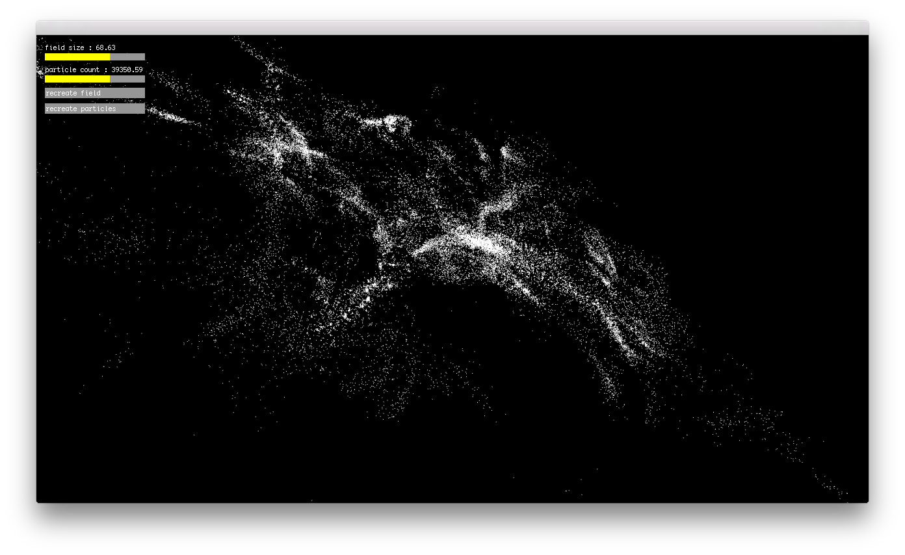

# 3D Curl Noise in Pex / WebGL

[Live version](http://szymonkaliski.github.io/pex-exp-curl-noise/)

<p align="center"></p>

## Installation

```
git clone ...
npm install
```

## Usage

```
npm start   # run in plask
npm run web # run in browser
```

